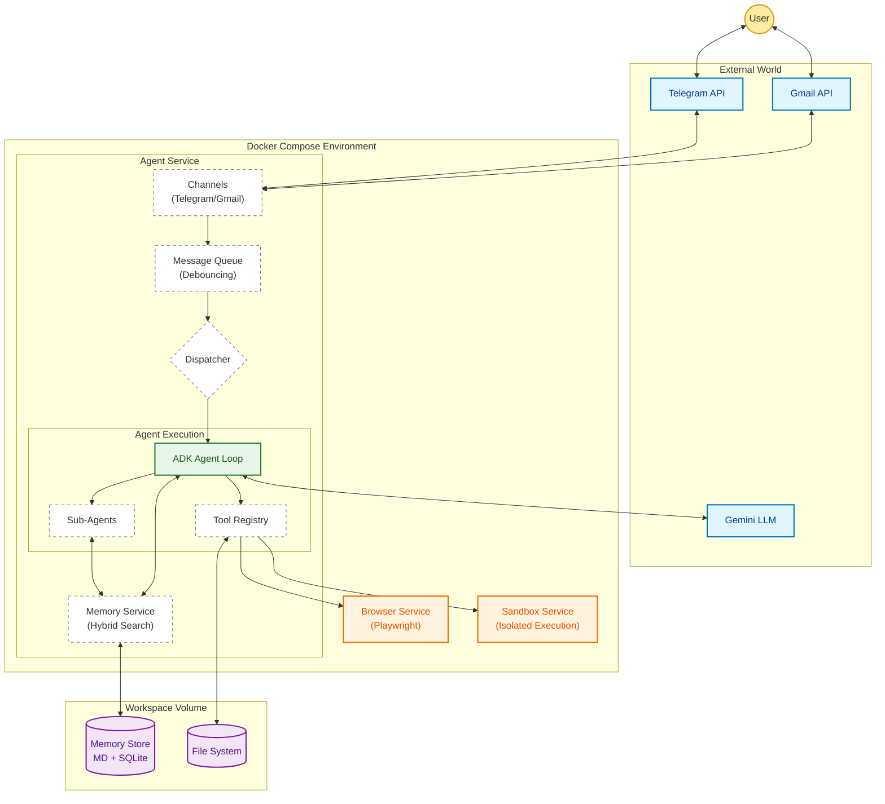

<p align="center">
  
</p>

<p align="center">
  <a href="#setup"></a>
  <a href="#architecture"></a>
  <a href="#observability-with-langfuse"></a>
  
</p>

---


> **Project Status:** This is a **VERY EARLY** version and **under active development**. It is more an idea and rough but working sketch than a finished product.

> ADK-Claw is **not** a clone of [OpenClaw](https://github.com/openclaw). It is a free interpretation that takes inspiration from OpenClaw's strengths — autonomous tool use, self-extending capabilities, persistent memory — and reimplements them from scratch on top of [Google ADK](https://google.github.io/adk-docs/), with a focus on tighter security (sandboxed execution and guardrails). But theres still a lot missing :).

## Key Feature: Self-Extending Agent

Unlike static chatbots, ADK-Claw **evolves its own capabilities at runtime**. The agent can dynamically create and persist both **sub-agents** and **reusable tools (skills)** — no redeployment needed.

**Dynamic Sub-Agents** — The agent can spin up specialized sub-agents on the fly using `create_dynamic_agent`. Each gets its own system prompt, model, and tool set. Sub-agent configs are saved as YAML in `workspace/agents/` and **persist across restarts**, so the agent builds up a growing team of specialists over time.

```
User: "I need a research agent that can browse the web and summarize findings"
Claw: Creates a research_agent with browse_webpage + execute_code tools → available immediately
```

**Dynamic Skills** — The agent can write reusable Python tools using `create_skill`. Skills are saved to `workspace/skills/` and automatically become callable tools on subsequent turns. This lets the agent **build its own toolbox** — from data transforms to API wrappers to file processors.

```
User: "Create a tool that converts CSV to markdown tables"
Claw: Writes the skill → csv_to_markdown(path="data.csv") is now a tool it can call anytime
```

Both sub-agents and skills survive container restarts via the workspace volume, so the agent's capabilities **compound over time**.

**Custom Task Scheduling** — The agent can manage its own scheduled tasks via the `heartbeat_manager` sub-agent. Ask it to set up recurring jobs and it writes them to `workspace/CUSTOM_HEARTBEAT.md`, which the heartbeat scheduler picks up automatically. Supports intervals (`Every 2 hours`) and fixed times (`Every day at 09:00`).

```
User: "Remind me every morning at 9 to check my calendar"
Claw: Creates a heartbeat entry → runs autonomously every day at 09:00
```

## Architecture

ADK-Claw is a containerized microservices application with three services:



- **Agent** — The main Python application. Connects to Telegram (and optionally Gmail), runs the LLM agent loop, manages memory.
- **Browser** — A FastAPI service using Playwright for headless web browsing with multi-step interaction. Supports persistent sessions with click, fill, scroll, and other actions. Screenshots are returned as inline images to the LLM via `MultimodalToolResultsPlugin`. Connected to the external network.
- **Sandbox** — A FastAPI service for Python code execution. Runs on an isolated internal network with no internet access, read-only filesystem, 512MB memory limit, and 1 CPU.

## How It Works

### Message Flow

```
User sends Telegram message (or email arrives)
        │
        ▼
  TelegramChannel / GmailChannel   Receives message via long-polling
        │
        ▼
   MessageQueue            Buffers messages per chat with a debounce timer
        │                  (default 2s — collects rapid-fire messages into one batch)
        ▼
   Dispatcher              Lane-based orchestrator with concurrent queues
        │
        ├── chat lane      ◀── MessageQueue batches
        ├── heartbeat lane ◀── HeartbeatScheduler triggers
        │
        ▼
   ADK Runner              Runs the LlmAgent in an agentic loop
        │
        ├──▶ Gemini LLM    Generates responses and decides which tools to call
        │
        ├──▶ Tools          search_memory, execute_code, browse_webpage, ...
        │
        ├──▶ Sub-agents     memory_curator, heartbeat_manager, email_calendar_manager
        │
        ▼
  TelegramChannel / GmailChannel   Sends response back
        │
        ▼
  Memory flush             After N events (default 20), session is flushed
                           to a daily markdown log in workspace/memory/
```

Chat and heartbeat lanes run concurrently — a long-running heartbeat (agent doing tool calls) never blocks real-time chat responses. Within each lane, work items process sequentially to avoid session races.

### Agent Setup

The agent is created in `agent.py` using Google ADK's `LlmAgent`:

- **Model**: Configurable, defaults to `gemini-3-flash-preview`
- **Instructions**: Loaded from `workspace/RULES.md` (defines personality and behavior)
- **Tools**: Tool functions registered with the agent (see below)
- **Sub-agents**: Specialized agents for memory curation, heartbeat management, and email/calendar
- **Session**: In-memory session service tracks conversation state per chat
- **Memory**: `MarkdownMemoryService` integrates with ADK's memory interface

### Tools

The agent has these tools available during conversations:

| Tool | Description | Backend |
|------|-------------|---------|
| `search_memory(query)` | Search past conversations and saved notes using hybrid BM25 + vector ranking | Local markdown files + SQLite |
| `browse_webpage(url, action, selector)` | Fetch page text or take a screenshot | Browser service (Playwright) |
| `browser_interact(action, session_id, ...)` | Multi-step browser interaction — goto, click, fill, scroll, etc. Returns screenshot as image after each action | Browser service (Playwright) |
| `execute_code(code, language, timeout)` | Run Python code in a sandbox (max 30s) | Sandbox service (subprocess) |
| `execute_shell(command, ...)` | Run shell commands in the sandbox | Sandbox service (subprocess) |
| `create_skill(name, description, code)` | Create a reusable Python skill that becomes a callable tool | Saved to workspace/skills/ |
| `create_dynamic_agent(name, ...)` | Create a persistent sub-agent with its own prompt, model, and tools | Saved to workspace/agents/ |
| `list_dynamic_agents()` | List all dynamically created sub-agents | workspace/agents/ |
| `list_skills()` | List available user-created skills | workspace/skills/ |
| `get_current_datetime()` | Get the current date and time | stdlib |

User-created skills are also exposed as callable tools via `SkillToolset`.

Tools are plain Python functions with docstrings — ADK exposes them to the LLM automatically.

### Sub-Agents

The main agent delegates to specialized sub-agents for certain tasks:

| Sub-Agent | Description | Tools |
|-----------|-------------|-------|
| `memory_curator` | Maintains `memory/MEMORY.md` as a concise summary of key facts. Merges new info, deduplicates, keeps sections organized. | `read_memory_file`, `write_memory_file` |
| `heartbeat_manager` | Manages the agent's scheduled tasks in `CUSTOM_HEARTBEAT.md`. | `add_scheduled_task`, `list_scheduled_tasks`, `remove_scheduled_task` |
| `email_calendar_manager` *(optional)* | Manages Gmail and Google Calendar. Only enabled when Gmail credentials are configured. | `send_email`, `search_emails`, `get_email`, `list_events`, `create_event`, `update_event`, `delete_event` |

### Email Guardrails

The `email_calendar_manager` sub-agent has two agent-level guardrails to prevent misuse:

**Recipient allowlist** (`before_tool_callback`) — When `EMAIL_ALLOWLIST` is set, `send_email` calls are blocked unless the recipient is on the comma-separated list. Leave empty to disable.

**Gemini-as-a-Judge** (`before_agent_callback`) — Before the email agent runs, a fast/cheap model evaluates the request for prompt injection, data exfiltration, spam/phishing, and other unsafe patterns. If the judge returns UNSAFE, the agent is blocked with an explanation. Always active when the email agent is enabled.

### Execution Guardrails

The `execute_code` and `execute_shell` tools have a two-layer guardrail (`before_tool_callback`) to prevent the LLM from being tricked into running malicious code via prompt injection:

**Static blocklist** — A fast regex-based check that blocks known-dangerous patterns before they reach the sandbox. Catches fork bombs, recursive root deletes, reverse shells, `curl|sh` piping, `os.system`/`subprocess` calls, and other common attack patterns. Zero-cost and always runs first.

**Gemini-as-a-Judge** — If the static blocklist passes, a fast model evaluates the code/command for prompt injection, data exfiltration, system damage, privilege escalation, and cryptomining patterns. Catches subtle attacks that static patterns miss.

Both layers are always active by default. Set `EXECUTION_GUARDRAIL_ENABLED=false` to disable (not recommended for production).

### Memory System

Memory has two layers:

**Curated memory** (`workspace/memory/MEMORY.md`) — The agent saves important facts here via the `memory_curator` sub-agent. This is long-term, structured knowledge organized under markdown headings. The curator merges, deduplicates, and keeps it concise.

**Session logs** (`workspace/memory/YYYY-MM-DD.md`) — After a configurable number of events (default 20), the current session is automatically flushed to a daily markdown file. This captures conversation history.

**Search** — Both layers are indexed together using a hybrid approach:
- **BM25** (via `rank-bm25`) for full-text keyword matching
- **Vector search** (via Gemini embeddings + `sqlite-vec`) for semantic similarity
- **RRF fusion** combines both rankings via Reciprocal Rank Fusion

Markdown files are split into chunks by heading, and the top matching chunks are returned with source attribution. The index is rebuilt lazily — only when a search is performed after new content has been written.

### Heartbeat Scheduler

The heartbeat system enables autonomous scheduled tasks. It reads `workspace/HEARTBEAT.md` (built-in) and `workspace/CUSTOM_HEARTBEAT.md` (user-managed via the `heartbeat_manager` sub-agent). Each heading is a schedule and the body is a prompt:

```markdown
# Every 24 hours

Review your memory and summarize important patterns.

# Every day at 09:00

Check if there are any pending tasks saved in memory.
```

Supported schedule formats:
- `Every N hours`
- `Every N minutes`
- `Every day at HH:MM`

When a task fires, it's enqueued on the Dispatcher's heartbeat lane and processed through the same agent pipeline as a regular message. The response is sent to the configured admin chat. Because heartbeat runs on its own lane, it never blocks chat responses.

**Custom task schedules** — You can ask the agent to create, list, or remove scheduled tasks at any time. The `heartbeat_manager` sub-agent writes entries to `workspace/CUSTOM_HEARTBEAT.md`, which is picked up automatically by the scheduler. For example, tell the agent *"remind me every day at 09:00 to check my calendar"* and it will create the corresponding heartbeat entry.

### Channels

**[Telegram](src/adk_claw/channels/telegram/README.md)** — Primary channel. Uses `python-telegram-bot` with long-polling. Messages are debounced per chat before being sent to the agent.

**[Gmail](src/adk_claw/channels/gmail/README.md)** *(optional)* — Polls the inbox at a configurable interval (default 30s). Incoming emails are routed through the same dispatcher as chat messages. Replies are threaded to the original email. Enabled when `GMAIL_CREDENTIALS_FILE` is set. Uses OAuth2 authentication.

### Message Debouncing

The `MessageQueue` groups rapid messages from the same chat into a single batch. When a message arrives, it starts (or resets) a timer. After the debounce period (default 2 seconds) with no new messages, the batch is sent to the agent as one combined prompt. This avoids triggering separate LLM calls for each line when a user sends multiple messages quickly.

## Project Structure

```
src/adk_claw/               # Main agent application
├── agent.py                 # LlmAgent + Runner creation
├── config.py                # Settings (pydantic-settings, .env)
├── dispatcher.py            # Lane-based orchestrator (chat + heartbeat)
├── actions/                 # Tool functions exposed to the LLM
├── agents/                  # Sub-agent definitions (heartbeat, memory curator, email)
├── channels/                # Telegram and Gmail channel implementations
├── guardrails/              # Email and execution safety guardrails
├── memory/                  # Hybrid BM25 + vector search over markdown
└── skills/                  # Dynamic skill loading (SkillToolset)

services/
├── browser/                 # Playwright web browsing service (FastAPI)
└── sandbox/                 # Code & shell execution service (FastAPI)

workspace/                   # Runtime data (mounted as volume)
├── RULES.md                 # Agent personality & instructions
├── HEARTBEAT.md             # Built-in scheduled task definitions
├── CUSTOM_HEARTBEAT.md      # User-managed scheduled tasks
├── agents/                  # Dynamic sub-agent YAML configs
├── skills/                  # User-defined reusable skills
├── files/                   # Shared file workspace (sandbox cwd)
└── memory/                  # Memory storage (MEMORY.md + daily logs)
```

## Setup

### Prerequisites

- Docker and Docker Compose
- A Telegram bot token (from [@BotFather](https://t.me/BotFather))
- A Google API key with Gemini access

### Configuration

Copy the example env file and fill in your credentials:

```bash
cp .env.example .env
```

| Variable | Default | Description |
|----------|---------|-------------|
| `TELEGRAM_BOT_TOKEN` | *(required)* | Telegram Bot API token |
| `GOOGLE_API_KEY` | *(required)* | Google API key for Gemini |
| `MODEL_NAME` | `gemini-3-flash-preview` | Gemini model to use |
| `APP_NAME` | `adk-claw` | Application identifier |
| `BASE_DIR` | `workspace` | Path to workspace directory |
| `DEBOUNCE_SECONDS` | `2.0` | Message batching delay |
| `HEARTBEAT_CHECK_INTERVAL` | `60` | Seconds between heartbeat checks |
| `SESSION_IDLE_TIMEOUT` | `1800` | Seconds of inactivity before session rotation |
| `ADMIN_CHAT_ID` | *(optional)* | Telegram chat ID for heartbeat messages |
| `BROWSER_SERVICE_URL` | `http://browser:8000` | Browser service endpoint |
| `SANDBOX_SERVICE_URL` | `http://sandbox:8000` | Sandbox service endpoint |
| `GMAIL_CREDENTIALS_FILE` | *(optional)* | Path to Gmail OAuth credentials JSON. Enables email/calendar tools and sub-agent. |
| `GMAIL_TOKEN_FILE` | `/secrets/gmail_token.json` | Path to stored Gmail OAuth token |
| `GMAIL_CHANNEL_ENABLED` | `true` | Set to `false` to use email/calendar tools without polling the inbox |
| `GMAIL_POLL_INTERVAL` | `30.0` | Seconds between Gmail inbox polls |
| `GMAIL_LABEL_FILTER` | *(optional)* | Gmail label to filter incoming mail |
| `EMAIL_ALLOWLIST` | *(optional)* | Comma-separated list of allowed email recipients. Empty = disabled. |
| `EMAIL_GUARDRAIL_MODEL` | `gemini-2.5-flash-lite` | Model used by the email Gemini-as-a-Judge guardrail |
| `EXECUTION_GUARDRAIL_MODEL` | `gemini-2.5-flash-lite` | Model used by the execution Gemini-as-a-Judge guardrail |
| `EXECUTION_GUARDRAIL_ENABLED` | `true` | Set to `false` to disable execution guardrails |
| `LANGFUSE_PUBLIC_KEY` | *(optional)* | Langfuse public key for tracing |
| `LANGFUSE_SECRET_KEY` | *(optional)* | Langfuse secret key for tracing |
| `LANGFUSE_HOST` | `https://cloud.langfuse.com` | Langfuse endpoint |

### Running

#### Standard (Linux/Windows)

```bash
docker compose up --build
```

#### macOS (Apple Silicon)

On macOS, use the provided override file to ensure correct platform compatibility:

```bash
docker compose -f docker-compose.yml -f docker-compose.mac.yml up --build
```

This starts all three services (Agent, Browser, Sandbox). The main agent waits for the browser and sandbox health checks to pass before initializing.

### Development

Install dependencies locally with [uv](https://docs.astral.sh/uv/):

```bash
uv sync --dev
```

Run tests:

```bash
uv run pytest
```

## Observability with Langfuse

ADK-Claw supports optional tracing via [Langfuse](https://langfuse.com), which provides full visibility into the agent's execution. In a complex agentic system like this — with tool calls, sub-agent delegation, memory lookups, and multi-step reasoning — understanding *what the agent actually did* (and why) is critical for debugging and improvement.

### Why tracing matters for agents

A single user message can trigger a long chain of internal steps: the LLM decides to search memory, then calls a tool, delegates to a sub-agent, which makes its own tool calls, and finally composes a response. Without tracing, this is a black box. Langfuse captures the full execution tree so you can:

- **Debug failures** — See exactly which tool call returned an error, which sub-agent was invoked, and what the LLM saw at each step.
- **Understand cost** — Track token usage and latency per LLM call, broken down by agent and tool.
- **Spot regressions** — Compare traces over time to catch changes in agent behavior after prompt or model updates.
- **Optimize prompts** — Inspect the full context the LLM received (system prompt + memory + tool results) to refine instructions.

### Enabling Langfuse

Add your Langfuse credentials to `.env`:

```bash
LANGFUSE_PUBLIC_KEY=pk-lf-...
LANGFUSE_SECRET_KEY=sk-lf-...
LANGFUSE_HOST=https://cloud.langfuse.com    # or your self-hosted instance
```

That's it. When both keys are set, ADK-Claw automatically instruments the Google ADK agent loop via `openinference-instrumentation-google-adk`. Every LLM call, tool invocation, and sub-agent execution is traced and sent to your Langfuse dashboard. When the keys are absent, tracing is completely disabled with zero overhead.

## Dependencies

| Package | Purpose |
|---------|---------|
| `google-adk` | Agent Development Kit — agent loop, sessions, memory interface |
| `google-genai` | Gemini API client |
| `python-telegram-bot` | Telegram bot framework |
| `pydantic-settings` | Settings management from `.env` |
| `rank-bm25` | BM25 ranking for memory search |
| `sqlite-vec` | Vector similarity search in SQLite |
| `numpy` | Numerical operations for embeddings |
| `httpx` | HTTP client for calling sidecar services |
| `langfuse` | Optional tracing and observability |
| `google-api-python-client` | Google Workspace APIs (Gmail, Calendar) |
| `google-auth-oauthlib` | OAuth2 authentication for Google APIs |
| `fastapi` / `uvicorn` | Web framework for browser and sandbox services |
| `playwright` | Headless browser automation |
